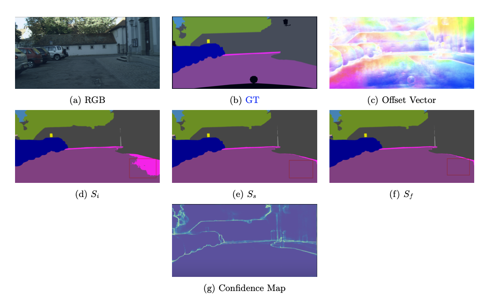
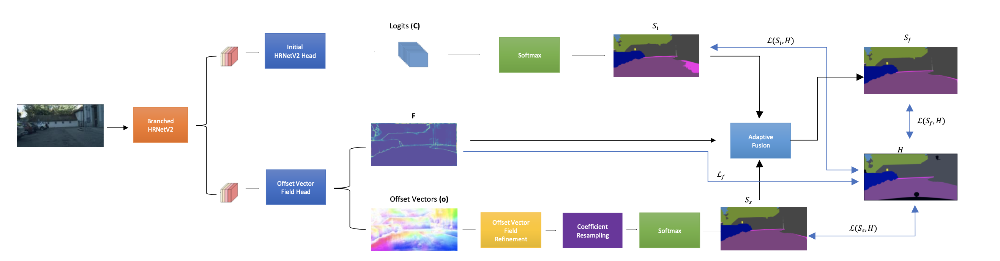

# Semantic Segmentation with Deep Convolutional Networks

Author: Stamatis Alexandropoulos

Supervisor: [Prof. Petros Maragos (NTUA)](https://robotics.ntua.gr/members/maragos/)

Co-supervisor [Dr. Christos Sakaridis (ETH)](https://people.ee.ethz.ch/~csakarid/)

Based on knowledge about the high regularity of real scenes, we propose a method for improving class predictions by learning to selectively exploit information from coplanar pixels. In particular, we introduce a prior which claims that for each pixel, there is a seed pixel which shares the same prediction with the former. As a result of this, we design a network with two heads. The first head generates pixel-level classes, whereas the second generates a dense offset vector field that identifies seed pixel positions. Seed pixels’ class predictions are then utilized to predict classes at each point. To account for possible deviations from precise local planarity, the resultant prediction is adaptively fused with the initial prediction from the first head using a learnt confidence map. The entire architecture is implemented on HRNetV2, a state-of-the-art model on Cityscapes dataset. The offset vector-based HRNetV2 was trained on both Cityscapes and ACDC datasets. We assess our method through extensive qualitative and quantitative experiments and ablation studies and compare it with recent state-of-the-art methods demonstrating its superiority and advantages. To sum up, we achieve better results than the initial model.

[Project page](http://artemis.cslab.ece.ntua.gr:8080/jspui/handle/123456789/18457)

This is the reference PyTorch implementation for training and evaluation of HRNet using the method described in this thesis.

<p align="center">
  
</p>

## License

This software is released under a creative commons [license](LICENSE.txt) which allows for personal and research use only. For a commercial license please contact the authors. You can view a license summary [here](http://creativecommons.org/licenses/by-nc/4.0/).

## Offset vector-based HRNetV2
<p align="center">
  
</p>

Offset vector-based HRNetV2 consists of two output heads. The first head outputs pixel-level Logits (C), while the second head outputs a dense offset vector field (o) identifying positions of seed pixels along with a confidence map (F). Then, the coefficients of seed pixels are used to predict classes at each position. The resulting prediction (S<sub>s</sub>) is adaptively fused with the initial prediction (S<sub>i</sub>) using the confidence map F to compute the final prediction S<sub>f</sub>


## Contents
1. [Installation](#Installation)
2. [Training](#Training)
3. [Evaluation](#Evaluation)
4. [Citation](#citation)
5. [Contributions](#Contributions)

## Installation

For setup, you need:

1. Linux
2. NVIDIA GPU with CUDA & CuDNN
3. Python 3
4. Conda 
5. PyTorch=1.1.0 following the [official instructions](https://pytorch.org/)
6. Install dependencies: pip install -r requirements.txt


## Data preparation
You need to download the [Cityscapes](https://www.cityscapes-dataset.com/), [ACDC](https://acdc.vision.ee.ethz.ch/)  datasets.

Your directory tree should be look like this:
````bash
$ROOT/data
├── cityscapes
│   ├── gtFine
│   │   ├── test
│   │   ├── train
│   │   └── val
│   └── leftImg8bit
│       ├── test
│       ├── train
│       └── val
├── acdc
│   ├── gt
│   │   ├── fog
│   │   ├── night
│   │   └── rain
│   │   └── snow
│   └── rgb_anon
│   │   ├── fog
│   │   ├── night
│   │   └── rain
│   │   └── snow
├── list
│   ├── cityscapes
│   │   ├── test.lst
│   │   ├── trainval.lst
│   │   └── val.lst
│   ├── acdc
│   │   ├── test.lst
│   │   ├── trainval.lst
│   │   └── val.lst
````
### Train and test
Please specify the configuration file.

For example, train the HRNet-W48 on Cityscapes with a batch size of 8 on 4 GPUs:
````bash
python -m torch.distributed.launch --nproc_per_node=4 tools/train.py --cfg experiments/cityscapes/seg_hrnet_w48_train_512x1024_sgd_lr1e-2_wd5e-4_bs_8_epoch484.yaml
````

For example, evaluating our model on the Cityscapes validation set with multi-scale and flip testing:
````bash
python tools/test.py --cfg experiments/cityscapes/seg_hrnet_w48_train_512x1024_sgd_lr1e-2_wd5e-4_bs_8_epoch484.yaml \
                     TEST.MODEL_FILE hrnet_w48_cityscapes_cls19_1024x2048_trainset.pth \
                     TEST.SCALE_LIST 0.5,0.75,1.0,1.25,1.5,1.75 \
                     TEST.FLIP_TEST True
````
Evaluating our model on the Cityscapes test set with multi-scale and flip testing:
````bash
python tools/test.py --cfg experiments/cityscapes/seg_hrnet_w48_train_512x1024_sgd_lr1e-2_wd5e-4_bs_8_epoch484.yaml \
                     DATASET.TEST_SET list/cityscapes/test.lst \
                     TEST.MODEL_FILE hrnet_w48_cityscapes_cls19_1024x2048_trainset.pth \
                     TEST.SCALE_LIST 0.5,0.75,1.0,1.25,1.5,1.75 \
                     TEST.FLIP_TEST True
````

## Citation

If you find our work useful in your research please use [this](http://artemis.cslab.ece.ntua.gr:8080/jspui/handle/123456789/18457) identifier to cite or link to this item.


## Contributions

If you find any bug in the code. Please report to <br>
Stamatis Alexandropoulos (stamatisalex7@gmail.com)
